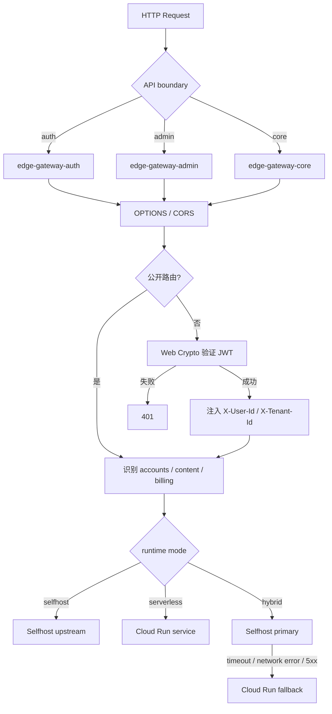

# Edge Gateway 使用与运行时指南

Edge Gateway 是一个超轻量级、Fetch API 兼容的应用网关，面向 Cloudflare Worker 的边缘部署场景设计，也可以嵌入 Node.js 20+ 或 Deno 1.37+ 应用中运行。

它负责 API 入口层的少量、确定性工作：CORS 预检、JWT 边缘验签、用户上下文注入、按运行模式选择 upstream，以及 hybrid 模式下的请求级故障转移。

它不是业务应用服务器，也不直接连接 PostgreSQL、Supabase 或 Git 仓库。Git-backed CMS 由 `content-service` 负责，Edge Gateway 只负责把内容 API 安全地转发到该服务。

## 设计目标

- **零重依赖**：运行时使用原生 `fetch`、`Request`、`Response`、Web Crypto 和 `AbortController`。
- **边缘优先**：Cloudflare Worker 是一等部署目标，适合低延迟 API 入口和跨域预检。
- **小产物**：每个 boundary 的可执行 bundle 严格小于 `3 MiB`，方便独立发布、快速回滚和灵活调度。
- **可移植 handler**：核心接口是 `fetch(request, env)`，可被 Cloudflare、Deno 或 Node.js 的 Fetch adapter 调用。
- **低 CPU**：网关不做密码哈希、图片处理、数据库查询或内容渲染，只做轻量协议和路由判断。
- **配置外置**：域名、Worker 名称、upstream 和 runtime mode 来自 GitOps；密钥来自 Vault。
- **请求级容灾**：hybrid 模式先访问 selfhost，再在超时、网络错误或 5xx 时切换 Cloud Run。

## 请求处理流程



### 处理顺序

1. 根据 Worker boundary 判断路径归属；不属于当前 boundary 的请求返回 404。
2. `OPTIONS` 请求立即返回 `204` 和 CORS headers。
3. 公开路由跳过用户 JWT；受保护的 `/api/*` 路由必须携带 Bearer token。
4. 使用 Web Crypto 验证 HMAC-SHA256 JWT 签名，并检查 `exp`。
5. 把可信 claims 注入 `X-User-Id` 和 `X-Tenant-Id`，覆盖客户端同名 header。
6. 根据路径选择 accounts、content 或 billing upstream。
7. 根据 `RUNTIME_MODE` 直连 selfhost、直连 Cloud Run，或执行 hybrid failover。

## 三个 API boundary

Edge Gateway 拆成三个独立 Worker，每个可执行 bundle 都必须严格小于 `3 MiB`，避免把所有 API 入口打成一个大 bundle：

| Boundary | 入口文件 | 路由 | 主要职责 |
| --- | --- | --- | --- |
| auth | `src/workers/auth.ts` | `/api/auth/*`、`/api/v1/auth/*` | 登录、注册、刷新、OAuth |
| admin | `src/workers/admin.ts` | `/api/admin/*` | 管理 API，默认需要 JWT |
| core | `src/workers/core.ts` | `/api/*` 兜底 | 账户、内容、计费等其他 API |

Cloudflare Worker 配置分别对应 `wrangler.auth.toml`、`wrangler.admin.toml` 和 `wrangler.core.toml`。Worker 名称、域名和 route 不写入 TypeScript 运行时代码，而由 GitOps deployment script 注入。

构建门禁由 `npm run check:bundle-size` 执行。它使用 Wrangler 的 minify dry-run 产出三个 Worker bundle，按 `3 × 1024 × 1024` bytes 计算上限；达到或超过 `3 MiB` 直接失败。Source map 只用于本地检查，不计入上传的 Worker 可执行 bundle，也不会随默认部署上传。

## Runtime mode

### selfhost

```text
DNS → VPS Full Stack
    ├── Console
    ├── Accounts
    ├── Content
    └── Billing
        └── self-managed PostgreSQL
```

selfhost 是 DNS 直达模式，不需要部署 Edge Gateway Worker。GitOps 部署脚本看到 `selfhost` 时会直接跳过 Worker 发布；如果在本地或特殊环境显式调用 handler，则只使用 `PRIMARY_UPSTREAM`，不要求 fallback。

### serverless

```text
DNS
└── Cloudflare Pages
    └── SSR ×5
        └── Edge Gateway ×3
            ├── auth
            ├── admin
            └── core
                ├── Cloud Run accounts
                ├── Cloud Run content-service
                └── Cloud Run billing-service
                    └── Supabase Cloud DB
```

serverless 模式不访问 selfhost primary。accounts、content 和 billing API 分别使用自己的 Cloud Run upstream。

### hybrid

```text
DNS → Cloudflare Pages → SSR ×5 → Edge Gateway ×3
                                      ├── selfhost primary
                                      └── Cloud Run fallback
```

hybrid 当前采用 request-level failover：

- primary 默认超时为 `2500ms`；
- 网络错误、连接失败或 primary 返回 5xx 时触发 fallback；
- 4xx 不触发 fallback，避免掩盖业务鉴权或参数错误；
- 响应通过 `X-Upstream-Route` 标记实际路径。

GitOps 中的 `routing.weight` 用于声明流量策略；当前 UAT hybrid 配置是 selfhost `100`、serverless `0`，并使用请求级故障转移，不会因为健康检查自动修改 DNS 权重。

## Git-backed CMS

内容服务从 Git 仓库同步 Markdown/YAML 等内容并建立内存索引。典型链路如下：

```text
Cloudflare Pages SSR
        ↓
edge-gateway-core
        ↓  X-Service-Token（仅服务端注入）
content-service
        ↓
knowledge.git / content repository
```

以下路径会路由到 `CONTENT_UPSTREAM`：

- `/api/v1/docs/*`
- `/api/v1/blogs/*`
- `/api/v1/products/*`
- `/api/v1/website/*`
- `/api/v1/home/*`

这些读取 API 可由 SSR 在没有用户 JWT 的情况下调用，但 content-service 仍要求 `X-Service-Token`。Edge Gateway 会删除客户端提供的同名 header，再使用 Vault 注入的 `CONTENT_SERVICE_TOKEN`；浏览器不会获得该令牌。

计费 API（例如 `/api/v1/billing/plans`）使用 `BILLING_UPSTREAM`。Stripe webhook 保留由 accounts 处理，不会被错误转发到 billing-service。

## Runtime compatibility

### Cloudflare Worker

这是默认部署方式：

```ts
// src/workers/core.ts
import { createGatewayWorker } from '../gateway';

export default createGatewayWorker('core');
```

使用 Wrangler 发布时，Cloudflare 会调用标准 Fetch handler：

```text
worker.fetch(request, env)
```

### Deno

Deno 原生提供 `Request`、`Response`、`fetch`、`crypto.subtle` 和 `Deno.serve`，可以直接复用 handler：

```ts
import { createGatewayWorker } from './src/gateway.ts';

const gateway = createGatewayWorker('core');
const env = {
  RUNTIME_MODE: 'serverless',
  FALLBACK_UPSTREAM: Deno.env.get('FALLBACK_UPSTREAM'),
  CONTENT_UPSTREAM: Deno.env.get('CONTENT_UPSTREAM'),
  BILLING_UPSTREAM: Deno.env.get('BILLING_UPSTREAM'),
  JWT_SECRET: Deno.env.get('JWT_SECRET'),
  CONTENT_SERVICE_TOKEN: Deno.env.get('CONTENT_SERVICE_TOKEN'),
};

Deno.serve((request) => gateway.fetch(request, env));
```

### Node.js

Node.js 20+ 提供所需的 Fetch API、Web Crypto 和 AbortController。可以把 `createGatewayWorker()` 挂到任何支持 Fetch handler 的 Node.js HTTP adapter、框架或 serverless runtime 上：

```ts
import { createGatewayWorker } from './src/gateway.js';

const gateway = createGatewayWorker('core');

// adapter 负责把 Node.js IncomingMessage 转成 Request，
// 再把 Response 的 status、headers 和 body 写回 ServerResponse。
export async function handle(request: Request): Promise<Response> {
  return gateway.fetch(request, {
    RUNTIME_MODE: process.env.RUNTIME_MODE as 'selfhost' | 'serverless' | 'hybrid',
    PRIMARY_UPSTREAM: process.env.PRIMARY_UPSTREAM,
    FALLBACK_UPSTREAM: process.env.FALLBACK_UPSTREAM,
    CONTENT_UPSTREAM: process.env.CONTENT_UPSTREAM,
    BILLING_UPSTREAM: process.env.BILLING_UPSTREAM,
    JWT_SECRET: process.env.JWT_SECRET,
    CONTENT_SERVICE_TOKEN: process.env.CONTENT_SERVICE_TOKEN,
    TIMEOUT_MS: process.env.TIMEOUT_MS,
  });
}
```

网关本身不依赖 Express、Fastify、Hono、Axios 或 `jsonwebtoken`。Node.js adapter 可以由宿主应用自行选择，因此不会把某个 HTTP 框架强行带入 Worker bundle。

## Environment contract

| 变量 | 类型 | 用途 |
| --- | --- | --- |
| `RUNTIME_MODE` | `selfhost \| serverless \| hybrid` | 选择运行模式 |
| `PRIMARY_UPSTREAM` | URL | selfhost / hybrid primary |
| `FALLBACK_UPSTREAM` | URL | accounts Cloud Run fallback |
| `CONTENT_UPSTREAM` | URL | Git-backed content-service |
| `CMS_UPSTREAM` | URL | `CONTENT_UPSTREAM` 的兼容别名 |
| `BILLING_UPSTREAM` | URL | billing-service |
| `TIMEOUT_MS` | string number | hybrid primary timeout，默认 `2500` |
| `JWT_SECRET` | secret | JWT HMAC 密钥 |
| `CONTENT_SERVICE_TOKEN` | secret | content-service 服务间认证 |
| `JWT_ISSUER` | URL | GitOps / 部署元数据中的 issuer 配置 |

`JWT_SECRET` 和 `CONTENT_SERVICE_TOKEN` 不应写入 Git、Wrangler TOML 或公开环境变量。CI/CD 从 `https://vault.svc.plus` 读取，并通过 Wrangler secret 注入。

## UAT GitOps source of truth

三份完整声明位于 `ai-workspace-infra/gitops`：

```text
topology/uat/selfhost/runtime-topology.yaml
topology/uat/serverless/runtime-topology.yaml
topology/uat/hybrid/runtime-topology.yaml
```

每份声明都必须满足：

- `metadata.mode` 与 `spec.runtime.mode` 相同；
- runtime mode 只能是 `selfhost`、`serverless` 或 `hybrid`；
- 保留 5 个 SSR boundary、3 个 Edge Gateway boundary；
- 不在 GitOps 中写入 JWT、数据库、Cloudflare 或服务账号凭据；
- `core` 继续拥有 `/api/*` 兜底边界。

部署入口通过 `EDGE_GATEWAY_CONFIG_FILE` 指向编排器渲染后的声明。选择 selfhost 时部署脚本安全退出；选择 serverless 或 hybrid 时，读取对应声明发布三个 Worker。

## Local development

```bash
npm ci
npm test
npm run typecheck
npm run check:bundle-size
npm run dev
```

需要本地密钥时，从 Vault 生成未纳入 Git 的 `.env.local`：

```bash
export VAULT_TOKEN="s.your_vault_token"
./scripts/fetch_secrets.sh .env.local
```

本地开发不要把真实 secret 放进 `.env.example`、测试文件或提交记录。单元测试使用独立 fixture，覆盖 boundary ownership、JWT gate、三种 runtime mode、CMS 路由和 hybrid fallback。

## Constraints and non-goals

- 不安装 `axios`、`express`、`jsonwebtoken`、`crypto-js`、ORM 等重型运行时依赖。
- 不在 Edge Gateway 执行 bcrypt、数据库写入、Markdown 渲染或 Git clone。
- 不在 Worker 中保存持久化状态；内容索引、数据库和业务状态归后端服务负责。
- 不把 selfhost、serverless、hybrid 三种模式合并成一个含糊的默认声明。
- 不通过 DNS 隐式完成 hybrid 请求切换；请求级 fallback 必须有明确的遥测 header。
